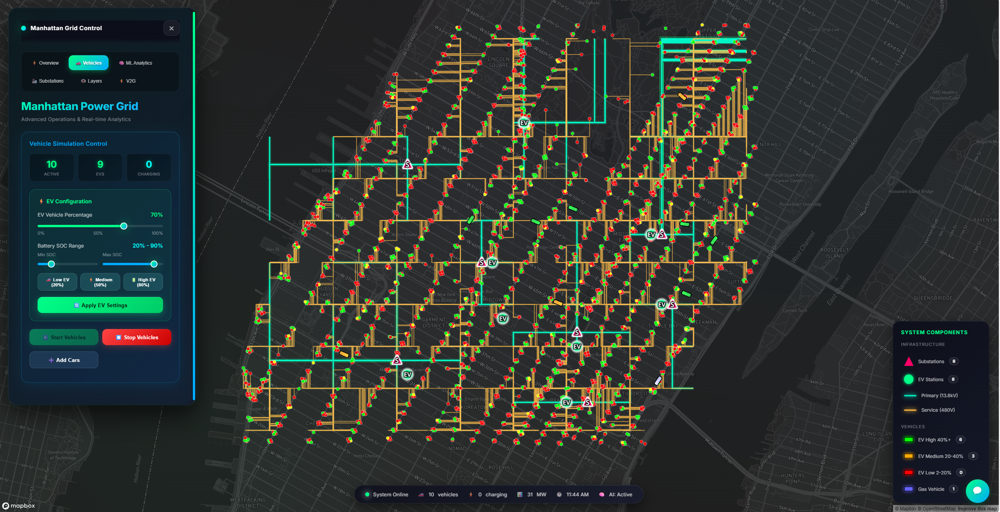

# Manhattan Power Grid - Advanced Operations Center

[](https://python.org)
[](https://flask.palletsprojects.com/)
[](https://eclipse.org/sumo/)
[](LICENSE)

A **world-class, real-time power grid simulation system** integrating electrical power flow analysis, traffic management, electric vehicle simulation, and Vehicle-to-Grid (V2G) energy trading. Built for Manhattan's power infrastructure with advanced AI analytics and machine learning optimization.



## 🎥 Live Demo

**Watch the full system demonstration on YouTube:**

[](https://youtu.be/36mGJWjrSxw)

🔗 **[Watch Demo: Manhattan Power Grid Simulation - Electric Vehicles, V2G & AI Analytics](https://youtu.be/36mGJWjrSxw)**

See the system in action with live power flow analysis, EV simulation, V2G emergency response, and AI-powered grid management.

## 🌟 Key Features

### ⚡ **Advanced Power Grid Simulation**
- **PyPSA Integration**: Real-time DC power flow analysis
- **8 Substations**: Realistic Manhattan power infrastructure
- **Distribution Network**: 13.8kV primary and 480V secondary systems
- **Load Management**: Dynamic load balancing and optimization

### 🚗 **Intelligent Vehicle Simulation**
- **SUMO Integration**: Eclipse SUMO traffic simulation
- **Electric Vehicle Fleet**: Configurable EV percentage (0-100%)
- **Battery Management**: SOC-based routing and charging behavior
- **Real-time Tracking**: Live vehicle positions and battery states

### 🔋 **Vehicle-to-Grid (V2G) Technology**
- **Bidirectional Energy Flow**: EVs provide power back to grid
- **Emergency Response**: Automatic V2G activation during outages
- **Dynamic Pricing**: Market-based energy trading
- **Revenue Optimization**: Maximize EV owner earnings

### 🧠 **AI-Powered Analytics**
- **Machine Learning**: Demand prediction and optimization
- **Real-time Insights**: Grid performance analytics
- **Predictive Maintenance**: Failure prediction and prevention
- **Interactive Chatbot**: AI assistant for grid operations

### 🎮 **Professional Web Interface**
- **Glassmorphic Design**: Modern, premium UI/UX
- **Real-time Visualization**: Live map with Mapbox integration
- **Interactive Controls**: Comprehensive system management
- **Responsive Design**: Works on desktop and mobile

## 🚀 Quick Start

### System Requirements

- **Python**: 3.8 or higher
- **RAM**: 8GB minimum (16GB recommended)
- **Storage**: 2GB free disk space
- **OS**: Windows 10+, macOS 10.14+, or Linux (Ubuntu 20.04+)
- **Browser**: Chrome, Firefox, Safari, or Edge (latest versions)

### Prerequisites

```bash
# Python 3.8+ required
python --version  # Should be 3.8+

# SUMO Traffic Simulator (1.15.0+)
# See installation instructions below for your OS
```

#### Installing SUMO

**Windows:**
1. Download the installer from [Eclipse SUMO Downloads](https://eclipse.org/sumo/)
2. Run the installer and follow the setup wizard
3. Add SUMO to your system PATH during installation

**macOS:**
```bash
# Using Homebrew
brew install sumo
```

**Linux (Ubuntu/Debian):**
```bash
sudo add-apt-repository ppa:sumo/stable
sudo apt-get update
sudo apt-get install sumo sumo-tools sumo-doc
```

### Installation

1. **Clone the repository**
   ```bash
   git clone https://github.com/XGraph-Team/SumoXPypsa.git
   cd SumoXPypsa
   ```

2. **Create virtual environment**
   ```bash
   python -m venv venv
   source venv/bin/activate  # On Windows: venv\Scripts\activate
   ```

3. **Install dependencies**
   ```bash
   pip install -r requirements.txt
   ```

4. **Set up environment variables**
   ```bash
   # Create .env file
   cat > .env << EOF
   # Server Configuration
   FLASK_PORT=5000
   FLASK_ENV=development
   FLASK_DEBUG=True

   # SUMO Configuration
   SUMO_HOME=/usr/share/sumo  # Update with your SUMO installation path
   
   # Mapbox Configuration (optional - for enhanced map features)
   # Get your free token at https://www.mapbox.com/
   MAPBOX_API_TOKEN=your_mapbox_token_here
   
   # Grid Configuration
   DEFAULT_EV_PERCENTAGE=0.7
   DEFAULT_VEHICLE_COUNT=10
   BATTERY_MIN_SOC=0.2
   BATTERY_MAX_SOC=0.9
   
   # V2G Configuration
   V2G_MARKET_PRICE=0.15
   V2G_POWER_RATE=250
   EMERGENCY_THRESHOLD=0.9
   EOF
   ```

5. **Configure SUMO_HOME (if not automatically set)**
   ```bash
   # Linux/Mac
   export SUMO_HOME=/usr/share/sumo
   
   # Windows (PowerShell)
   $env:SUMO_HOME = "C:\Program Files (x86)\Eclipse\Sumo"
   ```

6. **Run the application**
   ```bash
   python main_complete_integration.py
   ```

7. **Open your browser**
   ```
   http://localhost:5000
   ```

### Mapbox Setup (Optional)

For enhanced map features with satellite imagery and advanced styling:

1. Sign up for a free account at [Mapbox](https://www.mapbox.com/)
2. Navigate to your account dashboard
3. Copy your default public token
4. Add it to your `.env` file as `MAPBOX_API_TOKEN`

> Note: The application works without Mapbox using OpenStreetMap, but Mapbox provides better visuals and performance.

## 📖 Usage Guide

### Basic Operations

1. **Start Vehicle Simulation**
   - Click "Start Vehicles" in the control panel
   - Configure EV percentage and battery ranges
   - Watch real-time vehicle movement and charging

2. **Test Power Grid Scenarios**
   - Click on substations to trigger failures
   - Observe traffic light responses (yellow = caution mode)
   - Monitor EV station impacts

3. **Enable V2G Emergency Response**
   - Fail a substation to create power deficit
   - Enable V2G for that substation
   - Watch high-SOC EVs provide backup power

4. **Use AI Analytics**
   - Access ML dashboard for insights
   - Chat with AI assistant for recommendations
   - Generate comprehensive system reports

### Configuration

#### EV Fleet Configuration
```python
# In the web interface
EV Percentage: 70%        # 70% of vehicles are electric
Battery SOC Range: 20-90% # Battery state of charge range
```

#### V2G Settings
```python
# Automatic V2G activation during emergencies
Emergency Threshold: 90%  # Substation loading threshold
V2G Power Rate: 250kW    # Power per vehicle
Market Price: $0.15/kWh  # Energy trading price
```

## 🏗️ Architecture

### System Components

```
┌─────────────────┐    ┌─────────────────┐    ┌─────────────────┐
│   Web Frontend  │    │  Flask Backend  │    │  SUMO Simulator │
│                 │◄───┤                 │◄───┤                 │
│ • Mapbox Maps   │    │ • REST API      │    │ • Vehicle Sim   │
│ • Real-time UI  │    │ • WebSocket     │    │ • Traffic Mgmt  │
│ • Controls      │    │ • Data Processing│   │ • Route Planning│
└─────────────────┘    └─────────────────┘    └─────────────────┘
         │                       │                       │
         └───────────────────────┼───────────────────────┘
                                 │
┌─────────────────┐    ┌─────────────────┐    ┌─────────────────┐
│   PyPSA Grid    │    │   ML Engine     │    │   V2G Manager   │
│                 │    │                 │    │                 │
│ • Power Flow    │    │ • Demand Pred   │    │ • Energy Trade  │
│ • Load Analysis │    │ • Optimization  │    │ • Market Pricing │
│ • Grid Stability│    │ • AI Insights   │    │ • Route Planning │
└─────────────────┘    └─────────────────┘    └─────────────────┘
```

### File Structure

```
SumoXPypsa/
├── 📁 api/                    # API endpoints (organized)
├── 📁 core/                   # Core system components
│   ├── power_system.py        # PyPSA power grid
│   └── sumo_manager.py        # SUMO integration
├── 📁 static/                 # Web assets
│   ├── styles.css             # Main stylesheet
│   └── script.js              # Frontend JavaScript
├── 📁 data/                   # Data files and configs
├── 📁 docs/                   # Documentation
├── 📁 tests/                  # Test suites
├── main_complete_integration.py # Main application
├── integrated_backend.py      # Backend systems
├── v2g_manager.py             # V2G functionality
├── ml_engine.py               # ML analytics
├── ai_chatbot.py              # AI assistant
├── index.html                 # Main web interface
├── dashboard-preview.png      # Dashboard screenshot
├── requirements.txt           # Dependencies
├── .env.example               # Environment variables template
└── README.md                  # This file
```

## 🔧 API Reference

### Core Endpoints

#### System Status
```http
GET /api/status
```
Returns complete system status including vehicles, grid state, and performance metrics.

#### Network State
```http
GET /api/network_state
```
Returns detailed network topology with real-time component states.

### Vehicle Management
```http
POST /api/sumo/start
Content-Type: application/json

{
  "vehicle_count": 10,
  "ev_percentage": 0.7,
  "battery_min_soc": 0.2,
  "battery_max_soc": 0.9
}
```

### Power Grid Control
```http
POST /api/fail/Times%20Square
```
Triggers substation failure simulation.

```http
POST /api/restore/Times%20Square
```
Restores failed substation.

### V2G Operations
```http
POST /api/v2g/enable/Times%20Square
```
Enables V2G for specified substation.

```http
GET /api/v2g/status
```
Returns V2G system status and active sessions.

### AI Analytics
```http
POST /api/ai/chat
Content-Type: application/json

{
  "message": "Analyze grid performance",
  "user_id": "operator_1"
}
```

## 🧪 Testing

### Run Test Suite
```bash
# Unit tests
python -m pytest tests/unit/

# Integration tests
python -m pytest tests/integration/

# End-to-end tests
python -m pytest tests/e2e/

# All tests with coverage
python -m pytest --cov=. tests/
```

### Manual Testing Scenarios

1. **Basic Functionality**
   ```bash
   # Start system and verify all components load
   python main_complete_integration.py
   # Navigate to http://localhost:5000
   # Verify map loads and controls respond
   ```

2. **Vehicle Simulation**
   ```bash
   # Start SUMO simulation
   # Spawn 20 vehicles with 80% EVs
   # Verify vehicles appear on map and charge at stations
   ```

3. **Grid Failure Response**
   ```bash
   # Fail Times Square substation
   # Verify traffic lights turn yellow
   # Verify EV stations go offline
   # Enable V2G and verify emergency response
   ```

## 🤝 Contributing

We welcome contributions! Please follow these guidelines:

### Development Setup

1. Fork the repository
2. Create a feature branch: `git checkout -b feature/amazing-feature`
3. Make your changes and add tests
4. Run the test suite: `pytest`
5. Commit your changes: `git commit -m 'Add amazing feature'`
6. Push to the branch: `git push origin feature/amazing-feature`
7. Open a Pull Request

### Code Style

- Follow PEP 8 for Python code
- Use type hints where appropriate
- Add docstrings for all functions and classes
- Include unit tests for new features

### Commit Message Format

```
type: subject

body (optional)

footer (optional)
```

Types: `feat`, `fix`, `docs`, `style`, `refactor`, `test`, `chore`

Example:
```
feat: add renewable energy integration

- Implemented solar panel simulation
- Added wind turbine models
- Updated power flow calculations

Closes #123
```

## 📝 License

This project is licensed under the MIT License.

```
MIT License

Copyright (c) 2025 XGraph-Team

Permission is hereby granted, free of charge, to any person obtaining a copy
of this software and associated documentation files (the "Software"), to deal
in the Software without restriction, including without limitation the rights
to use, copy, modify, merge, publish, distribute, sublicense, and/or sell
copies of the Software, and to permit persons to whom the Software is
furnished to do so, subject to the following conditions:

The above copyright notice and this permission notice shall be included in all
copies or substantial portions of the Software.

THE SOFTWARE IS PROVIDED "AS IS", WITHOUT WARRANTY OF ANY KIND, EXPRESS OR
IMPLIED, INCLUDING BUT NOT LIMITED TO THE WARRANTIES OF MERCHANTABILITY,
FITNESS FOR A PARTICULAR PURPOSE AND NONINFRINGEMENT. IN NO EVENT SHALL THE
AUTHORS OR COPYRIGHT HOLDERS BE LIABLE FOR ANY CLAIM, DAMAGES OR OTHER
LIABILITY, WHETHER IN AN ACTION OF CONTRACT, TORT OR OTHERWISE, ARISING FROM,
OUT OF OR IN CONNECTION WITH THE SOFTWARE OR THE USE OR OTHER DEALINGS IN THE
SOFTWARE.
```

## 🙏 Acknowledgments

- **Eclipse SUMO** - Traffic simulation framework
- **PyPSA** - Power system analysis library
- **Mapbox** - Interactive mapping platform
- **Flask** - Web framework
- **OpenAI** - AI integration capabilities

## 🗺️ Roadmap

### Current Version (v1.0)
- ✅ Complete power grid simulation
- ✅ SUMO vehicle integration
- ✅ V2G energy trading
- ✅ AI analytics and chatbot
- ✅ Professional web interface

### Upcoming Features 
- 🔄 Real-time weather integration
- 🔄 Advanced ML demand forecasting
- 🔄 Multi-city support
- 🔄 Mobile app companion
- 🔄 Renewable energy sources (solar/wind)

### Future Vision 
- 🚀 Distributed grid simulation
- 🚀 Blockchain energy trading
- 🚀 IoT device integration
- 🚀 Digital twin capabilities
- 🚀 Predictive maintenance AI

## 🏆 Performance Metrics

- **Simulation Capacity**: Up to 1000 concurrent vehicles
- **Grid Resolution**: Real-time updates every 100ms
- **V2G Response Time**: < 2 seconds for emergency activation
- **API Latency**: Average < 50ms response time
- **Scalability**: Horizontally scalable with Docker/Kubernetes

## 📺 Media

- **[📹 Watch Demo Video](https://youtu.be/36mGJWjrSxw)** - Full system demonstration


<div align="center">

**Built with ❤️ for sustainable energy and smart city infrastructure**

[⭐ Star this repo](https://github.com/XGraph-Team/SumoXPypsa) • [🍴 Fork it](https://github.com/XGraph-Team/SumoXPypsa/fork) • [📺 Watch Demo](https://youtu.be/36mGJWjrSxw)

</div>
