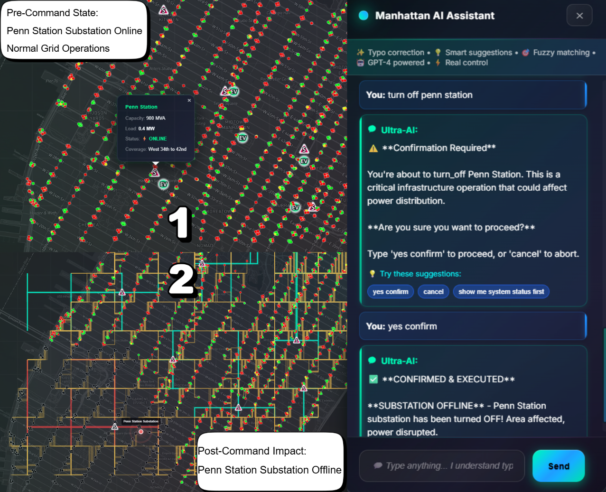

# SumoXPypsa - Manhattan Power Grid with LLM Scenario Control

[](https://python.org)
[](https://flask.palletsprojects.com/)
[](https://eclipse.org/sumo/)
[](https://pypsa.org)
[](https://openai.com)
[](LICENSE)

An **advanced, LLM-controlled power grid simulation system** integrating electrical power flow analysis, traffic management, electric vehicle simulation, and Vehicle-to-Grid (V2G) energy trading. Built for Manhattan's power infrastructure with **AI-driven scenario orchestration**, natural language control, and realistic time-of-day simulations.

> **🚀 What's New:** Unlike traditional grid simulators, this system features **LLM-to-Map commands** allowing natural language control of the entire simulation, **dynamic rush hour scenarios** with time-based vehicle patterns, **weather integration**, and **AI-orchestrated time progression**.



## 🎯 What Makes This Special?

This project extends the base SumoXPypsa framework with **groundbreaking LLM integration** that brings unprecedented control and realism:

| Feature | Base SumoXPypsa | This Project (LLM Enhanced) |
|---------|-----------------|----------------------------|
| **Control Interface** | Manual API calls | Natural language commands via AI |
| **Traffic Patterns** | Static vehicle count | Dynamic, time-based vehicle scaling |
| **Scenarios** | Basic failure testing | Rush hour, weather, time-of-day orchestration |
| **Load Modeling** | Fixed loads | Temperature-sensitive, time-varying loads |
| **System Integration** | Separate components | AI-orchestrated unified scenarios |
| **User Experience** | Technical commands | Conversational, intelligent control |

**Example:** Instead of making multiple API calls to configure a morning rush hour scenario, simply tell the AI: *"Simulate morning rush hour with hot weather"* and watch the system intelligently configure vehicles, loads, temperature, and traffic patterns.

## 🌟 Key Features

### 🤖 **LLM-Powered Scenario Control** ⭐ *UNIQUE TO THIS PROJECT*
- **Natural Language Commands**: Control the entire system through conversational AI
  - *"Set time to rush hour and increase temperature to 95°F"*
  - *"Show me morning traffic with 200 vehicles"*
  - *"Simulate a heatwave scenario"*
- **AI Scenario Orchestration**: Chatbot intelligently manages complex scenarios
- **Dynamic Time Control**: LLM changes time of day, triggering realistic traffic patterns
- **Weather Integration**: Temperature-based load adjustments and traffic changes
- **Smart Suggestions**: AI recommends scenarios and system optimizations

### 🕐 **Realistic Time-of-Day Simulation** ⭐ *UNIQUE TO THIS PROJECT*
- **Rush Hour Scenarios**:
  - **Morning Rush (7-9 AM)**: 200+ vehicles, high commercial loads, EV charging demand
  - **Midday (11 AM-2 PM)**: Moderate traffic, peak commercial activity
  - **Evening Rush (5-7 PM)**: Maximum vehicle density, residential load surge
  - **Night (10 PM-6 AM)**: Minimal traffic, reduced loads, off-peak charging
- **Automatic Vehicle Scaling**: Vehicle count changes realistically with time of day
- **Load Profile Dynamics**: Commercial/residential loads follow realistic daily patterns
- **Weather-Responsive**: Traffic and load adjust based on temperature/conditions

### ⚡ **Advanced Power Grid Simulation**
- **PyPSA Integration**: Real-time DC power flow analysis
- **8 Substations**: Realistic Manhattan power infrastructure
- **Distribution Network**: 13.8kV primary and 480V secondary systems
- **Dynamic Load Management**: Temperature-sensitive and time-based load balancing
- **Scenario-Aware**: Grid responds to LLM-commanded scenarios

### 🚗 **Intelligent Vehicle Simulation**
- **SUMO Integration**: Eclipse SUMO traffic simulation
- **Time-Based Fleet**: Vehicle count adapts to time of day (50-250 vehicles)
- **Electric Vehicle Fleet**: Configurable EV percentage (0-100%)
- **Battery Management**: SOC-based routing and charging behavior
- **Weather-Aware Routing**: Traffic patterns adjust to weather conditions

### 🔋 **Vehicle-to-Grid (V2G) Technology**
- **Bidirectional Energy Flow**: EVs provide power back to grid
- **Emergency Response**: Automatic V2G activation during outages
- **Dynamic Pricing**: Market-based energy trading
- **Revenue Optimization**: Maximize EV owner earnings
- **Scenario Integration**: V2G responds to LLM-triggered events

### 🧠 **AI-Powered Analytics & Control**
- **LLM Command Interface**: Full system control via natural language
- **Machine Learning**: Demand prediction and optimization
- **Scenario Intelligence**: AI understands context and makes smart decisions
- **Real-time Insights**: Grid performance analytics
- **Predictive Maintenance**: Failure prediction and prevention
- **Typo Correction**: Smart chatbot understands misspellings and variations

### 🎮 **Professional Web Interface**
- **Glassmorphic Design**: Modern, premium UI/UX
- **Real-time Visualization**: Live map with Mapbox integration
- **Scenario Controls**: Easy access to preset scenarios (rush hour, heatwave, etc.)
- **Interactive Controls**: Comprehensive system management
- **Time/Weather Display**: Live scenario indicators
- **Responsive Design**: Works on desktop and mobile

## 🚀 Quick Start

### Prerequisites

```bash
# Python 3.8+ required
python --version  # Should be 3.8+

# SUMO Traffic Simulator
# Download from: https://eclipse.org/sumo/
# Add SUMO_HOME to your environment variables
```

### Installation

1. **Clone the repository**
   ```bash
   git clone https://github.com/XGraph-Team/SumoXPypsa.git
   cd SumoXPypsa
   ```

2. **Create virtual environment**
   ```bash
   python -m venv venv
   source venv/bin/activate  # On Windows: venv\Scripts\activate
   ```

3. **Install dependencies**
   ```bash
   pip install -r requirements.txt
   ```

4. **Set up environment variables**
   ```bash
   cp .env.example .env
   # Edit .env with your configuration
   ```

5. **Run the application**
   ```bash
   python main_complete_integration.py
   ```

6. **Open your browser**
   ```
   http://localhost:5000
   ```

## 📖 Usage Guide

### LLM Scenario Control ⭐ *NEW*

Control the entire system using natural language through the AI chatbot:

#### Example Commands:
```
"Set time to morning rush hour"
→ System sets to 8 AM, spawns 200 vehicles, increases commercial loads

"Make it a hot summer day, 95 degrees"
→ Temperature rises, AC loads increase, traffic patterns adjust

"Show me evening traffic with 150 vehicles"
→ Time changes to 6 PM, 150 vehicles spawn, residential loads peak

"Simulate a weekend night"
→ Minimal traffic (50 vehicles), low loads, off-peak mode

"What happens during a heatwave at rush hour?"
→ AI creates combined scenario: high temp + high traffic
```

#### Available Scenario Presets:
- **Morning Rush** - 7-9 AM, 200+ vehicles, high commercial activity
- **Midday Normal** - 11 AM-2 PM, moderate traffic, balanced loads
- **Evening Rush** - 5-7 PM, maximum traffic, residential peak
- **Night Quiet** - 10 PM-6 AM, minimal traffic, low loads
- **Heatwave** - 95°F+, maximum AC loads, stressed grid
- **Winter Peak** - Cold weather, heating loads, reduced EV range
- **Weekend** - Lighter traffic, shifted load patterns

### Basic Operations

1. **Start Vehicle Simulation**
   - Click "Start Vehicles" in the control panel OR use chatbot
   - Configure EV percentage and battery ranges
   - Watch real-time vehicle movement and charging
   - Try: *"Start 100 vehicles with 80% EVs"*

2. **Test Power Grid Scenarios**
   - Click on substations to trigger failures OR use chatbot
   - Observe traffic light responses (yellow = caution mode)
   - Monitor EV station impacts
   - Try: *"Fail Times Square substation"*

3. **Enable V2G Emergency Response**
   - Fail a substation to create power deficit
   - Enable V2G for that substation OR use chatbot
   - Watch high-SOC EVs provide backup power
   - Try: *"Enable V2G for all failed substations"*

4. **Use AI Analytics**
   - Access ML dashboard for insights
   - Chat with AI assistant for recommendations
   - Generate comprehensive system reports
   - Try: *"Analyze current grid performance"*

5. **Time & Weather Control** ⭐ *NEW*
   - Use chatbot to change time of day
   - Set temperature and weather conditions
   - Watch system respond with realistic changes
   - Try: *"Fast forward to evening rush hour"*

### Configuration

#### EV Fleet Configuration
```python
# In the web interface
EV Percentage: 70%        # 70% of vehicles are electric
Battery SOC Range: 20-90% # Battery state of charge range
```

#### V2G Settings
```python
# Automatic V2G activation during emergencies
Emergency Threshold: 90%  # Substation loading threshold
V2G Power Rate: 250kW    # Power per vehicle
Market Price: $0.15/kWh  # Energy trading price
```

## 🏗️ Architecture

### System Components

```
┌─────────────────┐    ┌─────────────────┐    ┌─────────────────┐
│   Web Frontend  │    │  Flask Backend  │    │  SUMO Simulator │
│                 │◄───┤                 │◄───┤                 │
│ • Mapbox Maps   │    │ • REST API      │    │ • Vehicle Sim   │
│ • Real-time UI  │    │ • WebSocket     │    │ • Traffic Mgmt  │
│ • Controls      │    │ • Data Processing│   │ • Route Planning│
└─────────────────┘    └─────────────────┘    └─────────────────┘
         │                       │                       │
         └───────────────────────┼───────────────────────┘
                                 │
┌─────────────────┐    ┌─────────────────┐    ┌─────────────────┐
│   PyPSA Grid    │    │   ML Engine     │    │   V2G Manager   │
│                 │    │                 │    │                 │
│ • Power Flow    │    │ • Demand Pred   │    │ • Energy Trade  │
│ • Load Analysis │    │ • Optimization  │    │ • Market Pricing │
│ • Grid Stability│    │ • AI Insights   │    │ • Route Planning │
└─────────────────┘    └─────────────────┘    └─────────────────┘
```

### File Structure

```
manhattan-power-grid/
├── 📁 api/                    # API endpoints (organized)
├── 📁 core/                   # Core system components
│   ├── power_system.py        # PyPSA power grid
│   └── sumo_manager.py        # SUMO integration
├── 📁 static/                 # Web assets
│   ├── styles.css             # Main stylesheet
│   └── script.js              # Frontend JavaScript
├── 📁 data/                   # Data files and configs
├── 📁 docs/                   # Documentation
├── 📁 tests/                  # Test suites
├── main_complete_integration.py # Main application
├── integrated_backend.py      # Backend systems
├── v2g_manager.py             # V2G functionality
├── ml_engine.py               # ML analytics
├── ai_chatbot.py              # AI assistant
├── index.html                 # Main web interface
└── requirements.txt           # Dependencies
```

## 🔧 API Reference

### Core Endpoints

#### System Status
```http
GET /api/status
```
Returns complete system status including vehicles, grid state, and performance metrics.

#### Network State
```http
GET /api/network_state
```
Returns detailed network topology with real-time component states.

### Vehicle Management
```http
POST /api/sumo/start
Content-Type: application/json

{
  "vehicle_count": 10,
  "ev_percentage": 0.7,
  "battery_min_soc": 0.2,
  "battery_max_soc": 0.9
}
```

### Power Grid Control
```http
POST /api/fail/Times%20Square
```
Triggers substation failure simulation.

```http
POST /api/restore/Times%20Square
```
Restores failed substation.

### V2G Operations
```http
POST /api/v2g/enable/Times%20Square
```
Enables V2G for specified substation.

```http
GET /api/v2g/status
```
Returns V2G system status and active sessions.

### AI Analytics & LLM Control ⭐
```http
POST /api/ai/chat
Content-Type: application/json

{
  "message": "Set time to morning rush hour",
  "user_id": "operator_1"
}
```

```http
POST /api/scenario/set
Content-Type: application/json

{
  "scenario": "rush_hour_morning",
  "temperature": 75,
  "vehicle_count": 200
}
```

```http
GET /api/scenario/current
```
Returns current scenario state (time of day, temperature, active scenario)

## 🧪 Testing

### Run Test Suite
```bash
# Unit tests
python -m pytest tests/unit/

# Integration tests
python -m pytest tests/integration/

# End-to-end tests
python -m pytest tests/e2e/

# All tests with coverage
python -m pytest --cov=. tests/
```

### Manual Testing Scenarios

1. **Basic Functionality**
   ```bash
   # Start system and verify all components load
   python main_complete_integration.py
   # Navigate to http://localhost:5000
   # Verify map loads and controls respond
   ```

2. **Vehicle Simulation**
   ```bash
   # Start SUMO simulation
   # Spawn 20 vehicles with 80% EVs
   # Verify vehicles appear on map and charge at stations
   ```

3. **Grid Failure Response**
   ```bash
   # Fail Times Square substation
   # Verify traffic lights turn yellow
   # Verify EV stations go offline
   # Enable V2G and verify emergency response
   ```

## 🤝 Contributing

We welcome contributions! Please see [CONTRIBUTING.md](CONTRIBUTING.md) for guidelines.

### Development Setup

1. Fork the repository
2. Create a feature branch: `git checkout -b feature/amazing-feature`
3. Make your changes and add tests
4. Run the test suite: `pytest`
5. Commit your changes: `git commit -m 'Add amazing feature'`
6. Push to the branch: `git push origin feature/amazing-feature`
7. Open a Pull Request

### Code Style

- Follow PEP 8 for Python code
- Use type hints where appropriate
- Add docstrings for all functions and classes
- Include unit tests for new features

## 📝 License

This project is licensed under the MIT License - see the [LICENSE](LICENSE) file for details.

## 🙏 Acknowledgments

- **Eclipse SUMO** - Traffic simulation framework
- **PyPSA** - Power system analysis library
- **Mapbox** - Interactive mapping platform
- **Flask** - Web framework
- **OpenAI** - AI integration capabilities


## 🗺️ Roadmap

### Current Version (v2.5) - LLM Enhanced
- ✅ Complete power grid simulation
- ✅ SUMO vehicle integration with time-based dynamics
- ✅ V2G energy trading
- ✅ **LLM-to-Map command interface** ⭐
- ✅ **Rush hour scenario system** ⭐
- ✅ **Temperature/weather integration** ⭐
- ✅ **Time-of-day vehicle scaling** ⭐
- ✅ **AI scenario orchestration** ⭐
- ✅ Advanced AI analytics and chatbot
- ✅ Professional web interface

### Upcoming Features (v2.6)
- 🔄 Multi-day simulation with persistent state
- 🔄 Historical data playback
- 🔄 Custom scenario builder UI
- 🔄 Voice command integration
- 🔄 Mobile app companion

### Future Vision (v3.0)
- 🚀 Multi-city support
- 🚀 Distributed grid simulation
- 🚀 Blockchain energy trading
- 🚀 IoT device integration
- 🚀 Digital twin capabilities
- 🚀 Real-world grid data integration

---

<div align="center">

**Built with ❤️ for sustainable energy and smart city infrastructure**

[⭐ Star this repo](https://github.com/XGraph-Team/SumoXPypsa) • [🍴 Fork it](https://github.com/XGraph-Team/SumoXPypsa/fork) • [📝 Report Issues](https://github.com/XGraph-Team/SumoXPypsa/issues)

</div>
